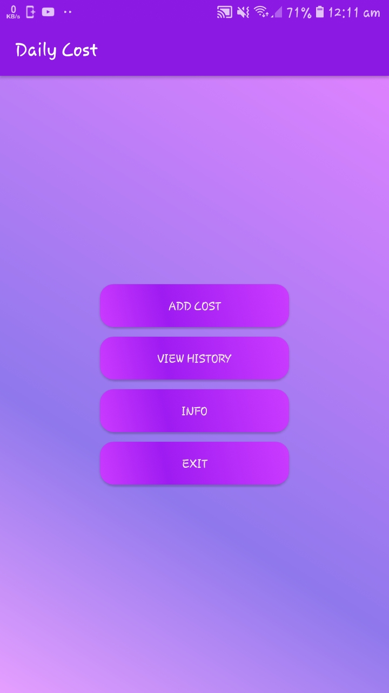
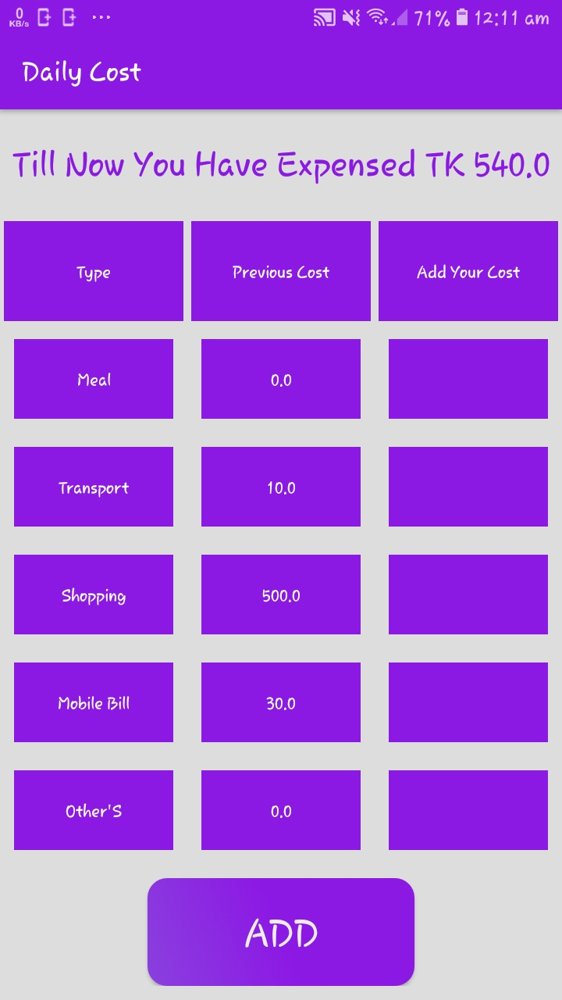

# Expenditure Management System

Description : 
o	Platform : Android 7.0 
o	Language : Java 
o	Database : MySql 
o	Core features : User can store their daily cost , shows Monthly cost 

Source Code is not avaiable for public.

Demo:  

